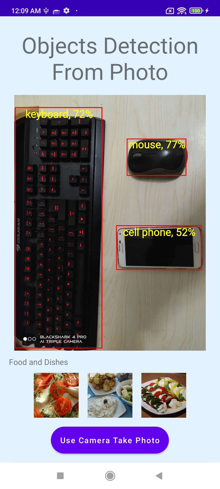
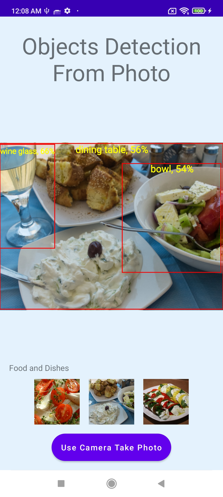

# Object Detection App

## Description

This is an Android application demonstrating real-time object detection using TensorFlow Lite. The app allows users to select preset images or capture new photos using the device camera and then identifies objects within the image, drawing bounding boxes around them and displaying their labels along with confidence scores.

This project originates from the TensorFlow Lite Object Detection Android Codelab and has been modified with UI enhancements and layout adjustments.

## Features

*   Detect objects in static images using a pre-trained TensorFlow Lite model (`model.tflite`).
*   Select sample images within the app for a test. 
*   Capture new photos using the device's back camera.
*   Display detected objects with bounding boxes and a confidence score.

## Screenshots


<div>
  
  
</div>

## Technical Details

### Model

*   The app utilizes EfficientDet-Lite (TFLite) model to perform object detection tasks from local photos or photos taken from Andoird camera.

### Detection Workflow

1.  An image is selected (sample or camera capture).
2.  The image (`Bitmap`) is loaded and optionally rotated based on EXIF data.
3.  The `Bitmap` is converted into a `TensorImage` object, the required input format for TFLite.
4.  An `ObjectDetector` instance is created using the `.tflite` model file and configured with options (e.g., `maxResults`, `scoreThreshold`).
5.  The `detector.detect(image)` method is called to perform inference.
6.  The results (`List<Detection>`) contain bounding boxes (`RectF`), labels (`String`), and confidence scores (`Float`) for detected objects.
7.  These results are processed, and bounding boxes along with labels/scores are drawn onto a copy of the input `Bitmap`.
8.  The final `Bitmap` with the detections overlaid is displayed in the `ImageView`.
9.  Detection is performed on a background thread using Kotlin Coroutines (`lifecycleScope.launch(Dispatchers.Default)`) to avoid blocking the UI thread.

### Key Components

*   **`MainActivity.kt`**: Handles UI interactions (button clicks, image selection), camera intent, TFLite model loading, object detection execution, and displaying results.
*   **`activity_main.xml`**: Defines the user interface layout using a `LinearLayout` and includes `ImageView`, `TextView`, and `Button` elements.
*   **`ObjectDetector` (TensorFlow Lite Task Library)**: The core class used for loading the model and performing object detection.
*   **`strings.xml`, `colors.xml`, `themes.xml`**: Standard Android resource files for managing text, colors, and app themes.
*   **`round_button_background.xml`**: Custom drawable for the round button background.

### Core Dependencies

*   `org.tensorflow:tensorflow-lite-task-vision`: TFLite Task Library for easy object detection.
*   `com.google.android.material:material`: Provides Material Design components and themes.
*   `org.jetbrains.kotlin:kotlin-stdlib`: Kotlin standard library.
*   `androidx.appcompat:appcompat`: Basic Android support library.
*   `androidx.core:core-ktx`: Kotlin extensions for Android core library.
*   `androidx.lifecycle:lifecycle-scope`: For running background tasks tied to the Activity lifecycle.

## Setup and Installation

To build and run this project locally:

1.  **Clone the repository:**
    ```bash
    git clone https://github.com/maverick001/ObjDetect.git
    ```
2.  **Open in Android Studio:** Open the cloned project directory (`<your-repository-url>/starter` or the root if you cloned the starter directory directly) in Android Studio (latest stable version recommended).
3.  **Gradle Sync:** Allow Android Studio to sync the project with Gradle. This will download the necessary dependencies.
4.  **Build:** Build the project using **Build > Make Project**.
5.  **Run:** Run the app on an Android emulator or a physical Android device (connected via USB with debugging enabled).

    *   **Note:** You might need to configure antivirus exclusions for the project directory and the `.gradle` cache directory (`C:\Users\<your_username>\.gradle` on Windows) to avoid potential build issues related to file locking.

## License

This project is licensed under the Apache License, Version 2.0. See the `LICENSE` file (if one exists) or individual file headers for details. 
